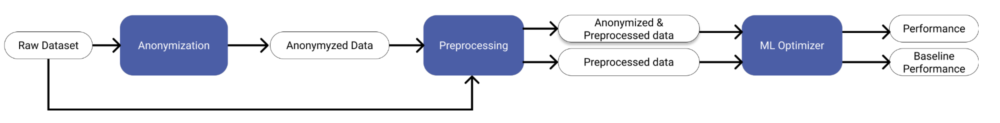

# K-anonymity : The devil's advocate

Anonymization is primarily a privacy concept → it always generates information loss and will decrease performance.

- How much anonymization is too much?
- What is the mechanism in which anonymization affects ML performance?
- Can we keep performance optimal while enforcing privacy?

## What is K anonymity

By combining different datasets with similar attributes, identifying information about any individuals may be possible via quasi-identifiers.

k-Anonymization is often referred to as the power of “hiding in the crowd.” Individuals’ data is pooled in a larger group, meaning information in the group could correspond to any single member of a group with size K.

This repository contains the course material for the course "Data Ethics & Security" at LMU Munich.

## Process

- 3 datasets with diversity of domain and tasks
- 3 anonymization methods: Classic Mondrian, Basic Mondrian and Datafly
- 2 ML algorithms (XGboost and Random Forest)

The idea is to perform hyperparameter optimization for each different levels of K anonymity, and understand the effects in performance.

It consists mainly on the implementation pipeline explained in the article and a notebook to plot it's results.

## Initialization

- Clone the repository
- install requirements with
 `pip install -r requirements.txt`
- We recommend using python 3.8

To run the pipeline, just run main.py. To see the results, go to the results_analysis notebook in the notebooks folder. A presentation is also in that folder.

In case any error happens, after running main.py you will see a log : app.log that may help you to understand the error.

## Elements

- utils: Contains the modules used in the pipeline
    - Anonymization: Contains the anonymization algorithms.
    - Preprocessing.py: Contains the preprocessing functions.
    - Optimizer.py: Contains the optimizer class that executes the ML tasks.
- main.py: main file to run the pipeline ( Note: It may take some time)
- metrics: contains the metrics obtain through pipeline runs
- results: folder with the anonymized & preprocessed datasets
- notebook: Notebooks used to analyze the results

